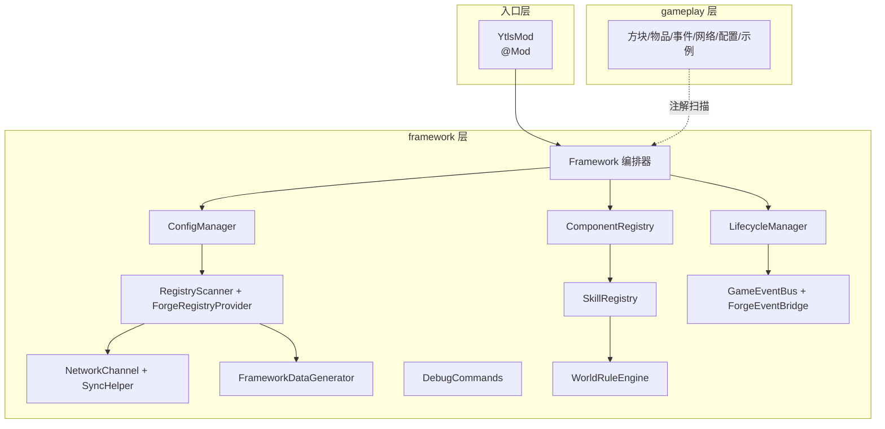

# YTLS 框架介绍与使用手册

本文档是 YTLS Minecraft Forge 开发框架的**唯一官方说明**：涵盖架构设计、模块能力与业务接入方式。内容基于当前仓库源码整理，并与实现保持一致。

| 项目 | 说明 |
|------|------|
| 目标版本 | Minecraft **1.20.4** + Forge **49.2.7** |
| 模组 ID | `ytls` |
| 业务扫描包 | `icu.ytlsnb.ytls.gameplay` |
| 框架包 | `icu.ytlsnb.ytls.framework` |
| 关联文档（只读参考） | [Minecraft Forge开发框架需求文档.md](./Minecraft%20Forge开发框架需求文档.md)、[框架验收要求.md](./框架验收要求.md) |

---

## 目录

- [第一部分：框架介绍](#第一部分框架介绍)
  - [1. 设计目标](#1-设计目标)
  - [2. 架构总览](#2-架构总览)
  - [3. 项目结构](#3-项目结构)
  - [4. 启动与初始化流程](#4-启动与初始化流程)
  - [5. 模块一览](#5-模块一览)
  - [6. 版本抽象与分支策略](#6-版本抽象与分支策略)
- [第二部分：使用指南](#第二部分使用指南)
  - [7. 创意分支工作流](#7-创意分支工作流)
  - [8. 注册体系](#8-注册体系)
  - [9. 生命周期](#9-生命周期)
  - [10. 语义化事件](#10-语义化事件)
  - [11. 网络与字段同步](#11-网络与字段同步)
  - [12. 配置体系](#12-配置体系)
  - [13. 资源与数据生成](#13-资源与数据生成)
  - [14. 调试体系](#14-调试体系)
  - [15. 组件系统](#15-组件系统)
  - [16. AI 框架](#16-ai-框架)
  - [17. 技能框架](#17-技能框架)
  - [18. 世界规则](#18-世界规则)
  - [19. 客户端表现](#19-客户端表现)
- [第三部分：测试与排错](#第三部分测试与排错)
  - [20. 自主测试指南](#20-自主测试指南)
  - [21. 常见问题](#21-常见问题)
- [附录](#附录)

---

# 第一部分：框架介绍

## 1. 设计目标

YTLS 框架面向「主分支维护框架 + 创意分支只写玩法」的多分支 Mod 开发模式，核心目标如下：

1. **入口极薄**：Forge `@Mod` 类仅调用 `Framework.initialize()`，不写业务。
2. **框架与业务物理隔离**：`framework/` 封装 Forge 底层；`gameplay/` 承载创意玩法，废弃分支可直接删除而不伤框架。
3. **注解驱动接入**：注册、事件、网络、配置、组件、技能等通过包扫描 + 注解自动挂载。
4. **版本可替换**：业务依赖框架抽象（`RegistryFacade`、`NetworkPayload`、`GameEvent` 等），Forge 实现集中在 Provider / Bridge 层，升级时优先改框架实现。

## 2. 架构总览



**数据与控制流要点：**

- 所有业务能力由 `Framework` 私有构造器内**固定顺序**初始化（见 §4）。
- `gameplay` 包下的类通过 Hutool 包扫描被发现；框架层也会扫描自身包（配置、内置网络消息、框架组件等）。
- Forge 原始事件经 `ForgeEventBridge` 转为语义事件，再分发给 `@Listen` 静态方法。

## 3. 项目结构

```text
src/main/java/icu/ytlsnb/ytls/
├── YtlsMod.java              # Forge 入口，仅 Framework.initialize()
├── ModConstants.java         # MOD_ID 等常量
├── framework/                # 【主分支维护】勿在创意分支修改
│   ├── bootstrap/            # 启动、生命周期、重载桥接
│   ├── registry/             # 统一注册（12 RegistryKind）
│   ├── event/                # 语义化事件总线
│   ├── network/ + sync/      # 网络消息与 @SyncField 同步
│   ├── config/               # @ModConfig 配置
│   ├── data/                 # GatherData 自动生成
│   ├── debug/                # /ytls 调试命令
│   ├── component/            # 组件 / Capability
│   ├── ai/                   # 行为树式 AI
│   ├── skill/                # 技能施法
│   ├── worldrule/            # 世界规则引擎
│   └── render/               # 服务端触发的客户端表现
└── gameplay/                 # 【创意分支编写】玩法代码
    ├── block/ item/ network/ config/ component/ skill/ worldrule/
    ├── registry/             # Supplier、RegistryContributor 示例
    └── common/               # 生命周期、事件接入示例

src/main/resources/assets/ytls/   # 手动纹理、音效等
src/generated/resources/          # gradlew runData 输出（已加入资源源集）
run/config/                       # 运行时生成的 toml 配置
```

## 4. 启动与初始化流程

`YtlsMod` 构造函数调用 `Framework.initialize()`，获取 Mod Event Bus 后创建 `Framework` 单例。构造器内按以下顺序编排（见 `Framework.java`）：

| 顺序 | 步骤 | 说明 |
|------|------|------|
| 1 | `ConfigManager.scanAndRegister` | 扫描 `framework` + `gameplay`，注册 ForgeConfig |
| 2 | `RegistryScanner.scanAndRegister` | 扫描 `gameplay` 注册条目，绑定 `RegistryAccess` |
| 3 | `registryProvider.bindToModBus` | 将 `DeferredRegister` 挂到 Mod Bus |
| 4 | `NetworkChannel.scanAndRegister` | 扫描双包，绑定 `NetworkAccess`、`SyncHelper` |
| 5 | `ComponentRegistry` / `SkillRegistry` / `WorldRuleEngine` | 第二优先级能力扫描 |
| 6 | `LifecycleManager` + `GameEventBus` + `ForgeEventBridge` | 生命周期与事件桥接 |
| 7 | `lifecycleManager.fire(CONSTRUCT)` | 构造阶段回调 |

**生命周期与 Forge 的绑定**由 `LifecycleManager` 完成：FML 的 `commonSetup`、`clientSetup`、`GatherDataEvent`、服务端启停等映射到 `LifecyclePhase` 枚举；配置/资源重载由 `FrameworkReloadBridge` 触发 `CONFIG_RELOAD` / `RESOURCE_RELOAD`。

## 5. 模块一览

### 5.1 第一优先级（基础底座）

| 模块 | 包路径 | 职责摘要 |
|------|--------|----------|
| 启动与基础框架 | `framework.bootstrap` | `Framework`、`LifecyclePhase`、`@OnLifecycle`、关闭清理 |
| 注册体系 | `framework.registry` | 12 类 `RegistryKind` 注解 + `RegistryContributor` |
| 事件体系 | `framework.event` | `GameEventBus`、`ForgeEventBridge`、15+ 语义事件 |
| 网络体系 | `framework.network` | `@NetworkMessage`、`PayloadCodec` 反射编解码 |
| 同步体系 | `framework.sync` | `@SyncField`、`SyncHelper.markDirty` |
| 配置体系 | `framework.config` | `@ModConfig`、`ConfigBuilder` |
| 资源生成 | `framework.data` | lang / model / loot / recipe / tag 等 Auto Provider |
| 调试体系 | `framework.debug` | `DevEnvironment`、`/ytls` 命令组 |

### 5.2 第二优先级（玩法支撑）

| 模块 | 包路径 | 职责摘要 |
|------|--------|----------|
| 组件系统 | `framework.component` | `@RegisterComponent`、`ComponentAccess`、Capability + NBT |
| AI 框架 | `framework.ai` | `Sequence/Selector/Leaf`、`AiManager` |
| 技能框架 | `framework.skill` | `@RegisterSkill`、`SkillCaster`、施法阶段 |
| 世界规则 | `framework.worldrule` | `@RegisterWorldRule`、`WorldRuleEngine` |
| 客户端表现 | `framework.render` | `PresentationEmitter` → 客户端粒子/音效/ActionBar |

第三优先级（脚本、热重载、更强 datagen 等）**尚未实现**，以需求文档规划为准。

## 6. 版本抽象与分支策略

**业务层应依赖的抽象：**

- 注册：`RegistryAccess` / `RegistryFacade`（勿在业务中新建 `DeferredRegister`）
- 网络：`NetworkPayload` + `NetworkAccess.channel()`
- 事件：`GameEvent` + `@Listen`
- 组件：`GameComponent` + `ComponentAccess`

**Forge 实现集中替换点：**

- `ForgeRegistryProvider`、`RegistryScanner`
- `NetworkChannel`、`PayloadCodec`
- `ForgeEventBridge`、`ComponentCapabilities`

**Git 分支约定：**

1. 从主分支拉创意分支：`git checkout -b feature/my-idea`
2. 只改 `gameplay/` 与 `assets/ytls/`
3. 通用能力回流主分支 `framework/`
4. 废弃创意分支直接删除，不影响框架完整性

---

# 第二部分：使用指南

## 7. 创意分支工作流

1. 确认 `gradle.properties` 中版本与主分支一致。
2. 在 `gameplay` 对应子包添加类并标注框架注解。
3. 需要纹理时放入 `assets/ytls/textures/`，执行 `gradlew runData`。
4. 本地 `gradlew runClient` 验证；按 [§20](#20-自主测试指南) 做回归。
5. 合并回主分支时仅提交 `gameplay` 与资源变更（除非同时升级框架）。

---

## 8. 注册体系

### 8.1 十二类 RegistryKind

| RegistryKind | 专用注解 | 注册模式 |
|--------------|----------|----------|
| `BLOCK` | `@RegisterBlock` | 无参构造，继承 `Block` |
| `ITEM` | `@RegisterItem` | 无参构造，继承 `Item` |
| `SOUND` | `@RegisterSound` | `RegistrySupplier<SoundEvent>` |
| `ENTITY` | `@RegisterEntity` | `RegistrySupplier<EntityType<?>>` |
| `BLOCK_ENTITY` | `@RegisterBlockEntity` | `RegistrySupplier<BlockEntityType<?>>` |
| `MENU` | `@RegisterMenu` | `RegistrySupplier<MenuType<?>>` |
| `MOB_EFFECT` | `@RegisterMobEffect` | `RegistrySupplier<MobEffect>` |
| `PARTICLE` | `@RegisterParticle` | `RegistrySupplier<ParticleType<?>>` |
| `ENCHANTMENT` | `@RegisterEnchantment` | `RegistrySupplier<Enchantment>` |
| `ATTRIBUTE` | `@RegisterAttribute` | `RegistrySupplier<Attribute>` |
| `CREATIVE_TAB` | `@RegisterCreativeTab` | `RegistrySupplier<CreativeModeTab>` |
| `RECIPE_SERIALIZER` | `@RegisterRecipeSerializer` | `RegistrySupplier<RecipeSerializer<?>>` |

兜底：`@RegisterEntry(kind = RegistryKind.XXX, value = "name")`。

### 8.2 扫描顺序（避免依赖未注册）

`RegistryKind.scanOrder()` 分三阶段：

1. **0**：`BLOCK`、`ITEM`
2. **10**：音效、实体、效果、粒子、附魔、属性、菜单、配方序列化器、创造栏
3. **20**：`BLOCK_ENTITY`（可安全调用 `RegistryAccess.block(...)`）
4. **最后**：`RegistryContributor` 实现类

### 8.3 快速示例：物品与方块

```java
@RegisterItem("my_ingot")
public class MyIngotItem extends Item {
    public MyIngotItem() { super(new Item.Properties()); }
}

@RegisterBlock("my_block")
public class MyBlock extends Block {
    public MyBlock() {
        super(BlockBehaviour.Properties.of().strength(2.0F, 6.0F));
    }
}
```

类须位于 `icu.ytlsnb.ytls.gameplay` 包下，具备 **public 无参构造**。注册名规则：`[a-z][a-z0-9_/]*`。重复注册在扫描期抛出 `IllegalStateException`。

### 8.4 Supplier 类型示例

```java
@RegisterSound("my_chime")
public final class MyChimeSound implements RegistrySupplier<SoundEvent> {
    @Override
    public SoundEvent get() {
        return SoundEvent.createVariableRangeEvent(ModResources.loc("my_chime"));
    }
}
```

更多示例见 `gameplay/registry/Example*Supplier.java`。

### 8.5 RegistryContributor（复杂注册）

菜单、附魔、依赖多方块的方块实体、**不宜塞进 12 类 DeferredRegister 的能力**（结构、地物、战利品修饰、Codec 等）应使用 `RegistryContributor`：

```java
public final class MyContributor implements RegistryContributor {
    @Override
    public void contribute(RegistryFacade registry) {
        registry.register(RegistryKind.MENU, "my_menu", () ->
                IForgeMenuType.create((windowId, inv, data) -> new MyMenu(windowId, inv)));
    }
}
```

参考：`gameplay/registry/ExampleGameplayRegistryContributor.java`。

方块实体也可用 `@RegisterBlockEntity` + Supplier（需处理 `BlockEntityType.Builder` 的自引用），或 Contributor。

### 8.6 访问已注册对象

```java
Block block = RegistryAccess.block("my_block");
Item item = RegistryAccess.item("my_ingot");
EntityType<?> mob = RegistryAccess.resolve(RegistryKind.ENTITY, "my_mob");
```

未注册时 `IllegalStateException` 会提示添加注解或 Contributor。

### 8.7 与数据生成联动

`ForgeRegistryProvider.catalog()` 驱动 Auto Provider：

- `BLOCK` / `ITEM`：lang、blockstate、model、loot（掉落自身）、recipe（`*_block` → `*_ingot` 命名约定）、`mineable/pickaxe` tag
- `CREATIVE_TAB`：lang（`itemGroup.ytls.<name>`）

其余类型 lang 需自行维护或扩展 Provider。

### 8.8 客户端 / 服务端约定

`DeferredRegister` 在 Mod 构造期双端绑定；**仅客户端逻辑**（Screen、渲染器）放在 `@OnLifecycle(CLIENT_SETUP)`，不要在 Supplier 内引用客户端类。

---

## 9. 生命周期

在 `gameplay` 包任意类中声明 **static** 方法：

```java
@OnLifecycle(LifecyclePhase.COMMON_SETUP)
public static void onCommonSetup() { }

@OnLifecycle(LifecyclePhase.CLIENT_SETUP)
public static void onClientSetup() { }

@OnLifecycle(LifecyclePhase.WORLD_LOAD)
public static void onWorldLoad(ServerLevel level) { }
```

| LifecyclePhase | 触发时机 |
|----------------|----------|
| `CONSTRUCT` | 框架构造完成 |
| `COMMON_SETUP` | FML 通用安装 |
| `CLIENT_SETUP` | 客户端安装（仅 CLIENT） |
| `DATA_GEN` | `GatherDataEvent`（`gradlew runData`） |
| `SERVER_STARTING` / `SERVER_STARTED` / `SERVER_STOPPING` | 服务端启停 |
| `SHUTDOWN` | `SERVER_STOPPING` 之后；逆序执行 `LifecycleCleanupRegistry` |
| `WORLD_LOAD` / `WORLD_UNLOAD` | 服务端维度加载/卸载 |
| `CONFIG_RELOAD` | Forge 配置热重载 |
| `RESOURCE_RELOAD` | 服务端 `/reload` 等数据包重载 |

关闭清理：

```java
Framework.registerCleanup("my-cache", () -> { /* 释放资源 */ });
```

维度加载有两种等价入口：`@OnLifecycle(WORLD_LOAD)` 与 `@Listen(LEVEL_LOAD)`（见 §10）。

---

## 10. 语义化事件

### 10.1 架构

```text
Forge 原始事件 → ForgeEventBridge → GameEventBus → @Listen 静态处理器
配置/资源重载 → FrameworkReloadBridge → GameEventBus + LifecycleManager
```

### 10.2 订阅方式

```java
@Listen(GameEventType.PLAYER_LOGIN)
public static void onLogin(PlayerLoginEvent event) {
    var player = event.player();
}
```

### 10.3 已桥接事件

| GameEventType | 说明 | 可取消 |
|---------------|------|--------|
| `PLAYER_LOGIN` / `PLAYER_LOGOUT` | 玩家登录/登出 | 否 |
| `PLAYER_TICK` | 玩家 tick（服务端 END） | 否 |
| `PLAYER_HURT` | 玩家受伤 | 是（可改 `amount` 并回写） |
| `PLAYER_DEATH` | 玩家死亡 | 否 |
| `LEVEL_LOAD` / `LEVEL_UNLOAD` | 维度加载/卸载 | 否 |
| `BLOCK_BREAK` / `BLOCK_PLACE` | 方块破坏/放置 | 是 |
| `ENTITY_SPAWN` | 实体进入世界（JoinLevel，非客户端） | 否 |
| `ENTITY_DEATH` | 生物死亡 | 否 |
| `CHUNK_LOAD` | 区块加载 | 否 |
| `DIMENSION_CHANGE` | 玩家换维度 | 否 |
| `ITEM_USE` | 右键使用物品（服务端） | 是 |
| `CONFIG_RELOAD` / `RESOURCE_RELOAD` | 配置/数据重载 | 否 |

可取消事件继承 `CancellableGameEvent`，调用 `event.setCancelled(true)` 会回写 Forge 原事件。

### 10.4 扩展新事件

1. 在 `GameEventType` 增加枚举值  
2. 在 `framework.event.events` 新建事件类  
3. 在 `ForgeEventBridge` 增加 `@SubscribeEvent` 桥接方法  

验收文档中列举但未桥接的事件（物品丢弃/拾取、GUI 打开等）需按上述步骤扩展。

---

## 11. 网络与字段同步

### 11.1 自定义网络消息

```java
@NetworkMessage(id = "my_action", direction = NetworkDirection.TO_SERVER)
public class MyActionMessage extends NetworkPayload {
    public String action = "";

    @Override
    public void handleServer(NetworkContext ctx) {
        ctx.enqueueWork(() -> {
            ServerPlayer sender = ctx.sender();
            // 校验权限与参数（框架不提供自动校验）
        });
    }
}
```

**要求：** public 实例字段、public 无参构造；业务不直接接触 `FriendlyByteBuf`。

**PayloadCodec 支持的字段类型：** `String`、`int`、`long`、`boolean`、`float`、`double`、`ResourceLocation`、`BlockPos`、`Map<String,String>`（JSON 序列化）。

**发送 API：**

```java
NetworkAccess.channel().sendToServer(message);
NetworkAccess.channel().sendToPlayer(message, serverPlayer);
NetworkAccess.channel().sendToAllPlayers(message);
NetworkAccess.channel().sendToPlayers(message, players);
```

**方向：** `TO_SERVER`、`TO_CLIENT`、`BIDIRECTIONAL`。

框架内置消息：`EntitySyncMessage`（组件同步）、`ClientPresentationMessage`（客户端表现）。示例业务消息：`gameplay/network/PingMessage.java`。

`ytls-framework.toml` 中 `debug.logNetwork = true` 可输出网络调试日志。

### 11.2 组件字段同步

```java
@RegisterComponent(value = "mob_state", targets = {ComponentTarget.ENTITY})
public class MobStateComponent implements GameComponent {
    @SyncField
    public int rageLevel;
}

// 服务端修改后
MobStateComponent state = ComponentAccess.getOrCreate(entity, MobStateComponent.type());
state.rageLevel = 3;
SyncHelper.markDirty(entity, MobStateComponent.type());
```

`@SyncField` 支持：`String`、`int`、`long`、`boolean`、`float`、`double`。

**注意：** 当前 `SyncHelper` 向**维度内全体玩家**广播同步包，无距离/追踪过滤；生产环境大量实体同步时需业务侧控制 `markDirty` 频率或后续框架优化。

---

## 12. 配置体系

```java
@ModConfig(scope = ConfigScope.COMMON, file = "my-gameplay.toml")
public class MyConfig {
    public static final ForgeConfigSpec SPEC;
    public static final ForgeConfigSpec.ConfigValue<Integer> SPAWN_RATE;

    static {
        ConfigBuilder b = ConfigBuilder.create("My Gameplay Config");
        b.push("spawn");
        SPAWN_RATE = b.define("rate", 10, 1, 100);
        b.pop();
        SPEC = b.build();
    }
}
```

配置类必须提供 `public static final ForgeConfigSpec SPEC`。首次运行生成于 `run/config/`。

**内置配置：**

- `ytls-framework.toml`：`debug.enabled`、`logRegistry`、`logEvents`、`logNetwork`
- `ytls-gameplay.toml`：示例 `GameplayConfig`

配置热重载触发 `CONFIG_RELOAD` 事件与生命周期。`/ytls reload-config` 仅提示使用 Forge 重载方式。

---

## 13. 资源与数据生成

```bash
gradlew runData
```

输出目录：`src/generated/resources/`。

| Provider | 输出 |
|----------|------|
| `AutoLangProvider` | `assets/ytls/lang/zh_cn.json` |
| `AutoBlockStateProvider` | blockstate + block model（默认 `cubeAll`） |
| `AutoItemModelProvider` | item model |
| `AutoBlockLootProvider` | 方块战利品表（掉落自身） |
| `AutoRecipeProvider` | `*_block` 3×3 → `*_ingot`（命名约定） |
| `AutoBlockTagProvider` | `mineable/pickaxe` |

**纹理约定：** `src/main/resources/assets/ytls/textures/block/<name>.png` 后再 runData。

`FrameworkDataGenerator` 会触发 `LifecyclePhase.DATA_GEN`。

---

## 14. 调试体系

开发环境（非 production）默认启用。生产环境在 `run/config/ytls-framework.toml` 设置：

```toml
[debug]
enabled = true
```

| 命令 | 说明 |
|------|------|
| `/ytls debug` | 确认调试模式 |
| `/ytls registry` | 按 RegistryKind 统计注册数量 |
| `/ytls reload-config` | 配置重载说明 |
| `/ytls skill cast <id>` | 测试技能施法 |
| `/ytls rule toggle <id>` | 开关世界规则 |
| `/ytls component stats` | 读写玩家 stats 组件并同步到客户端 |

需 OP 权限等级 2。日志前缀：`[ytls|framework|模块名]`。

---

## 15. 组件系统

为 Entity/Player、BlockEntity、Level（维度）提供统一附加数据，屏蔽 Forge Capability 细节。

```java
@RegisterComponent(value = "player_stats", targets = {ComponentTarget.PLAYER})
public final class PlayerStatsComponent implements GameComponent {
    public static ComponentType<PlayerStatsComponent> type() {
        return ComponentRegistry.type("player_stats");
    }
    // save / load / copyFrom ...
}

PlayerStatsComponent stats = ComponentAccess.getOrCreate(player, PlayerStatsComponent.type());
```

- 玩家死亡重生：`PlayerEvent.Clone` 时 `copyFrom`
- 与 `@SyncField` + `SyncHelper` 联动
- 示例：`gameplay/component/PlayerStatsComponent.java`、`framework.skill.SkillStateComponent`

**限制：** `ComponentTarget` 声明目前**未在运行时强制校验**；BlockEntity/维度级持久化需在业务中验证存档行为。

---

## 16. AI 框架

```java
AiManager.register("my_profile", new SelectorBehavior(List.of(
    new LeafBehavior(
        ctx -> ctx.target() != null,
        ctx -> ctx.mob().getNavigation().moveTo(ctx.target(), 1.0D))
)), 2);

AiManager.apply(mob, "my_profile");
```

| 类型 | 说明 |
|------|------|
| `LeafBehavior` | 条件 + 动作 |
| `SequenceBehavior` | 全部可执行才执行 |
| `SelectorBehavior` | 第一个可执行节点 |
| `BehaviorGoal` | 包装为原版 `Goal` |

`AiManager.scanProfiles` 当前为空壳，profile 需**代码注册**并在生成事件等时机手动 `apply`。示例：`gameplay/common/ExampleSecondPrioritySetup.java`。

---

## 17. 技能框架

```java
@RegisterSkill("my_skill")
public class MySkill implements Skill {
  public ResourceLocation id() { return ModResources.loc("my_skill"); }
  public int cooldownTicks() { return 60; }
  public int castTicks() { return 20; }
  public boolean canCast(SkillContext ctx) { ... }
  public void onCastStart(SkillContext ctx) { ... }
  public void onCastTick(SkillContext ctx) { ... }
  public void onCastEnd(SkillContext ctx) { ... }
}

SkillCaster.tryCast(livingEntity, "my_skill");
```

`SkillTickHandler` 在服务端 tick 施法进度。客户端表现通过 `PresentationEmitter`（§19），勿在 `Skill` 内直接调用客户端 API。

示例：`gameplay/skill/ExampleSlashSkill.java`。`SkillStateComponent` 中 `cooldowns` Map **未** `@SyncField`，冷却状态以服务端为准。

---

## 18. 世界规则

```java
@RegisterWorldRule(value = "blood_moon", priority = 100)
public class BloodMoonRule implements WorldRule {
    public void onTick(RuleContext context) { ... }
}

WorldRuleEngine.setEnabled("blood_moon", false);
```

`WorldRuleTickHandler` 在服务端 `LevelTickEvent`（END）按优先级驱动。`RuleScope`（GLOBAL/DIMENSION/BIOME/REGION）**尚未参与** tick 过滤；`onEnable`/`onDisable` 在开关时**未自动调用**。

示例：`gameplay/worldrule/ExampleBloodMoonRule.java`。

---

## 19. 客户端表现

**仅服务端调用：**

```java
PresentationEmitter.actionBar(serverPlayer, "技能释放！");
PresentationEmitter.sound(serverPlayer, "minecraft:entity.player.attack.sweep", 1.0F, 1.0F);
PresentationEmitter.particle(serverLevel, pos, "happy_villager");
```

经 `ClientPresentationMessage` 发往客户端，由 `ClientPresentationHandler` 执行。音效 ID 无效时 warn 并跳过。

**已知限制：** 粒子表现当前客户端**固定使用** `ParticleTypes.HAPPY_VILLAGER`，payload 中的 `particleId` 尚未解析（见附录 B）。

---

# 第三部分：测试与排错

## 20. 自主测试指南

### 20.1 测试前准备

```bash
gradlew compileJava    # 预期 BUILD SUCCESSFUL
gradlew runClient      # 可进世界无 crash
```

开发环境下调试命令自动可用；否则设置 `ytls-framework.toml` 中 `debug.enabled = true`。

### 20.2 第一优先级检查项

| 类别 | 操作 | 预期 |
|------|------|------|
| 启动 | 观察控制台 | `Initializing YTLS framework`、`Framework initialized` |
| 生命周期 | 进世界 | `Example gameplay common setup complete`、`World loaded: minecraft:overworld` |
| 注册 | 启动日志 / `/ytls registry` | 各 RegistryKind 统计；创造模式可见示例方块/物品 |
| 事件 | 进世界、破坏方块 | `Player login:` 日志；无 `Lifecycle handler failed` |
| 网络 | 启动日志 | 注册 `ping`、`entity_sync`、`client_presentation` |
| 配置 | 首次运行 | 生成 `ytls-framework.toml`、`ytls-gameplay.toml` |
| datagen | `gradlew runData`（需贴图） | `src/generated/resources` 有 lang/model/loot/recipe/tags |
| 调试 | `/ytls debug`、`/ytls registry` | 正常返回 |

### 20.3 第二优先级检查项

| 类别 | 操作 | 预期 |
|------|------|------|
| 组件 | `/ytls component stats` 多次 | 数值递增并 `(synced)` |
| 技能 | `/ytls skill cast example_slash` | ActionBar、音效、粒子；冷却内失败 |
| 世界规则 | 等待约 60s / `rule toggle` | BloodMoon 日志可开关 |
| AI | 日志 | `Registered example AI profile`；对 Mob `apply` 后追击 |

### 20.4 回归清单

- [ ] 编译无 error  
- [ ] 客户端可进世界，无生命周期异常  
- [ ] 示例注册与 `/ytls registry` 正常  
- [ ] 配置文件自动生成  
- [ ] runData 产出 loot/recipe/tags  
- [ ] 组件/技能/世界规则调试命令可用  

完整验收标准见 [框架验收要求.md](./框架验收要求.md)。

---

## 21. 常见问题

**Q: 注册没生效？**  
检查类是否在 `icu.ytlsnb.ytls.gameplay` 包下；registry 名是否 `[a-z][a-z0-9_/]*`；是否有 public 无参构造。

**Q: 数据生成报错缺纹理？**  
先放置 `assets/ytls/textures/block/<name>.png`，或暂时移除对应 `@RegisterBlock`。

**Q: `/ytls` 命令不存在？**  
确认 `DevEnvironment.isDebugActive()` 与 OP 2 级权限。

**Q: 示例方块紫黑块？**  
缺少贴图或未 runData。

**Q: 技能无客户端表现？**  
须在集成服务端环境执行；检查 `client_presentation` 是否已注册。

**Q: 能否在业务层直接用 DeferredRegister？**  
不建议，会绕开统一命名、datagen 与版本抽象，增加分支合并成本。

---

# 附录

## 附录 A：示例代码索引

| 能力 | 路径 |
|------|------|
| 示例方块/物品 | `gameplay/block/ExampleBlock.java`、`gameplay/item/ExampleIngotItem.java` |
| Supplier 注册 | `gameplay/registry/Example*Supplier.java` |
| RegistryContributor | `gameplay/registry/ExampleGameplayRegistryContributor.java` |
| 方块实体 | `gameplay/blockentity/ExampleBlockEntity.java` |
| 生命周期/事件 | `gameplay/common/ExampleGameplaySetup.java` |
| 第二优先级初始化 | `gameplay/common/ExampleSecondPrioritySetup.java` |
| 网络 | `gameplay/network/PingMessage.java` |
| 配置 | `gameplay/config/GameplayConfig.java` |
| 组件 | `gameplay/component/PlayerStatsComponent.java` |
| 技能 | `gameplay/skill/ExampleSlashSkill.java` |
| 世界规则 | `gameplay/worldrule/ExampleBloodMoonRule.java` |

## 附录 B：已知限制（源码核对）

以下项影响「生产可用」评级，接入时请知悉：

| 项 | 说明 |
|----|------|
| 粒子表现 | `ClientPresentationHandler` 忽略 payload 粒子 ID，固定 `HAPPY_VILLAGER` |
| 同步范围 | `SyncHelper` 向维度全体玩家广播 |
| 组件目标 | `ComponentTarget` 未在 `ComponentAccess` 强制校验 |
| 调试命令耦合 | `DebugCommands` 引用 `gameplay.component.PlayerStatsComponent` |
| AI 扫描 | `AiManager.scanProfiles` 无自动扫描，需手动 `register`/`apply` |
| 世界规则 | `RuleScope` 未过滤；`onEnable`/`onDisable` 未挂钩 |
| 技能冷却 | `SkillStateComponent.cooldowns` 未同步到客户端 |
| 事件覆盖 | 验收文档部分事件（丢弃/拾取、GUI 等）未桥接 |
| 网络安全 | 无框架级包校验，需在 `handleServer` 自行验证 |
| 世界生成/Codec | 不纳入 12 类 RegistryKind，用 Contributor 或数据包 |

## 附录 C：依赖

- **Hutool** `cn.hutool:hutool-all:5.8.35`：包扫描、Map 字段 JSON 编解码  
- **Forge MDK** 1.20.4-49.2.7  

---

*文档维护：框架行为变更时，请同步更新本手册对应章节；需求与验收条款以 `Minecraft Forge开发框架需求文档.md`、`框架验收要求.md` 为准。*
